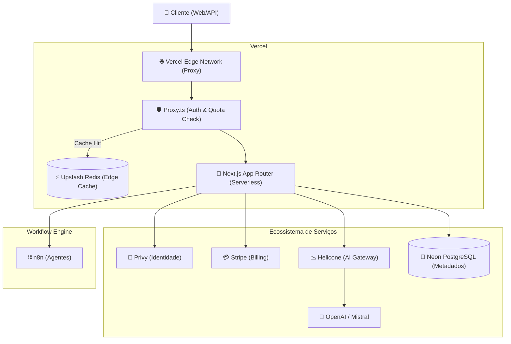

# 🏗️ Guia de Infraestrutura e Arquitetura Vercel

Este documento detalha a arquitetura de infraestrutura da plataforma **Agent**, otimizada para o ecossistema Vercel e focada em escalabilidade multi-tenant para 2026.

## 1. Visão Geral

A plataforma é uma aplicação **Next.js 16+** (App Router) hospedada na **Vercel**. A arquitetura é desenhada para ser "Edge-First", delegando autenticação, faturamento e governança de IA para parceiros especializados através de APIs, enquanto o núcleo reside em funções Serverless e na Edge Network da Vercel.

## 2. Desenho de Arquitetura

O fluxo abaixo representa como as requisições são processadas desde o cliente até os serviços de dados e IA:

## 3. Ambientes de Execução

### Edge Runtime
- **Componente:** `src/proxy.ts` (Substituto do Middleware convencional).
- **Função:** Identificação de Tenant via subdomínio, validação ultra-rápida de quotas e redirecionamento de tráfego.
- **Vantagem:** Latência mínima ( < 5ms) e execução distribuída globalmente.

### Node.js Serverless Runtime
- **Componente:** Chat API (`/api/agents/[id]/chat`), Ingest e Dashboard.
- **Função:** Processamento de lógica de negócio pesada, comunicação com banco de dados e orquestração de LLM.
- **Configuração:** Localizado em regiões específicas (ex: `iad1`) para proximidade com o Neon/OpenAI.

## 4. Tabela de Variáveis de Ambiente

| Variável | Descrição | Obrigatória | Ambiente |
| :--- | :--- | :---: | :--- |
| `DATABASE_URL` | String de conexão com o Neon PostgreSQL | Sim | Todos |
| `UPSTASH_REDIS_REST_URL` | URL da API REST do Upstash Redis | Sim | Pro/Prev |
| `UPSTASH_REDIS_REST_TOKEN` | Token de autenticação do Upstash | Sim | Pro/Prev |
| `NEXT_PUBLIC_PRIVY_APP_ID` | ID público da aplicação Privy | Sim | Todos |
| `PRIVY_APP_SECRET` | Secret key do servidor Privy | Sim | Pro/Prev |
| `STRIPE_SECRET_KEY` | Chave secreta do Stripe | Sim | Pro/Prev |
| `ENCRYPTION_KEY` | Chave de 32 bytes para criptografar tokens n8n | Sim | Todos |
| `NEXT_PUBLIC_STRIPE_PRO_PRICE_ID` | ID do preço do plano Pro no Stripe | Sim | Todos |
| `N8N_AUTH_TOKEN` | Token master de autenticação com o n8n | Sim | Todos |

## 5. CI/CD e Rollbacks

- **Deploy Automático:** Cada `git push` para a `main` dispara um deploy em Produção. Commits em branches secundárias geram **Preview Deployments**.
- **Instant Rollback:** Em caso de erro crítico, é possível reverter para qualquer versão anterior instantaneamente pelo painel da Vercel (Deployment > Rollback).
- **Build Step:** O projeto utiliza o comando `next build` com exportação **Standalone** para garantir portabilidade.

## 6. Monitorização e Logs

- **Runtime Logs:** Disponíveis em `Vercel Dashboard > Logs`. Filtre por caminhos (`/api/chat`) para depurar execuções de IA.
- **Edge Config/Logs:** O monitoramento do `proxy.ts` é feito separadamente em Edge Middleware Logs.
- **Analytics:** Usamos o Vercel Web Analytics e Speed Insights para monitorar Web Vitals.

## 7. Troubleshooting (Cenários Comuns)

### 1. Erro 402 Payment Required na API
- **Causa:** O `proxy.ts` detectou que o tenant atingiu o limite de cota no Upstash Redis (`tenant:ID:status = OVER_BUDGET`).
- **Solução:** Verificar o status do cliente no Stripe e atualizar o cache no Redis após o upgrade.

### 2. Timeout em Chamadas de IA (Serverless)
- **Causa:** A resposta do n8n/LLM demorou mais do que o limite da função Vercel (geralmente 10-15s no plano Hobby).
- **Solução:** Utilizar streaming (já implementado via `createTextStreamResponse`) para evitar timeouts de timeout de conexão e garantir que o corpo da resposta comece a fluir imediatamente.

### 3. Erro de Conexão com Banco de Dados (Neon)
- **Causa:** Máximo de conexões atingido ou IP não autorizado no Neon.
- **Solução:** O Neon escala automaticamente, mas em ambientes Vercel, certifique-se de usar o pooling do Prisma ou o proxy de conexão do Neon.
