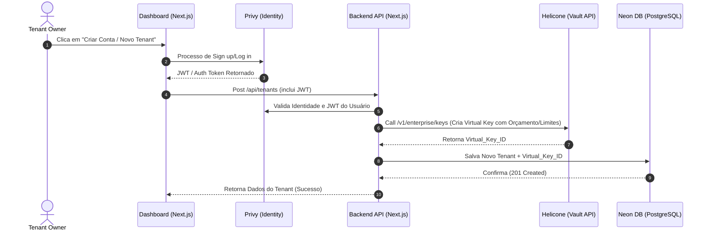
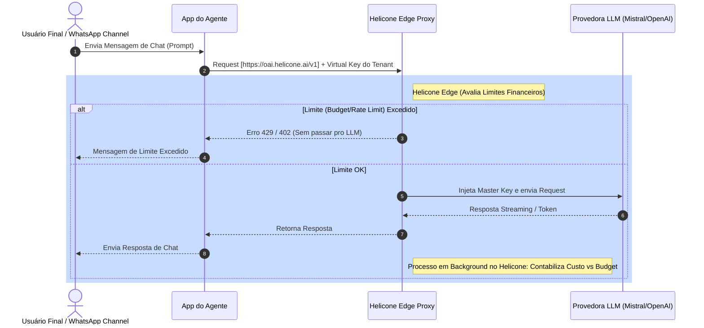
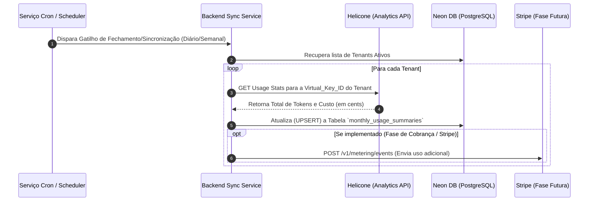

# Software Design Document (SDD) - Plataforma Multi-Tenant de Agentes de IA

## 1. Visão Geral (Overview)

Este documento descreve a arquitetura da Plataforma de Agentes de IA Multi-Tenant (Ecossistema "Govinda Systems"). O objetivo é prover uma infraestrutura que gerencie autenticação, faturamento e governança de forma descentralizada, robusta e escalável, sem a necessidade de infraestrutura custosa ou manuseio manual de limites no "Hot Path" (o caminho crítico das requisições em tempo real).

A principal decisão arquitetural deste documento é a delegação de controle financeiro, métricas e auditoria de requisições a serviços gerenciados externos (**Helicone**), focando o backend primário apenas no ciclo de vida lógico dos clientes (autenticação com **Privy** e faturamento assíncrono com o banco de dados **Neon** e futuramente **Stripe**).

---

## 2. Stack Tecnológica Base

A stack adota uma abordagem "serveless/managed" com responsabilidades altamente segregadas:

* **Identity Provider (Autenticação de Usuários / Dashboard):** [Privy](https://privy.io/) - Gerencia a identidade dos proprietários (Tenant Owners), login, senhas e conexões externas de contas.

* **LLM Gateway & Governança de Requisições:** [Helicone](https://helicone.ai) - Proxy gerenciado responsável por todo o roteamento, monitoramento de tokens, estabelecimento de limites de orçamento e geração de chaves virtuais (Vault).

* **Banco de Dados Persistente (Storage Central):** [Neon](https://neon.tech/) (PostgreSQL) - Usado no "Cold Path" para armazenar metadados dos tenants, referências a chaves e sincronizações de custos e eventos.

* **Motor de Faturamento (Billing Engine):** [Stripe Metered Billing](https://stripe.com) *(Mapeado para Fases Futuras)* - Responsável pela fatura final do final do mês automatizada baseada no uso excedente dos tenants.

---

## 3. Estratégia de Gateway de API e Governança

Para garantir um ambiente multi-tenant seguro e escalável, transferimos a camada de "Hot Path" inteiramente para o Helicone, evitando criar gargalos em nossa aplicação.

### 3.1. Modelo de Chaves Virtuais ("Virtual Key" Model)

A plataforma não armazena e nem usa diretamente a "Chave Mestra" (Master Key) das provedoras de IA (como a OpenAI e a Mistral) no código das rotas da API.

1. Guardamos a **Chave Mestra LLM** de forma segura no **Cofre (Vault)** do Helicone.

2. Através da API do Helicone, a nossa plataforma gera uma **Chave Virtual Helicone (Virtual Key)** única para cada tenant.

3. Nas aplicações-cliente (ou canais conectados como WhatsApp), os requests são enviados usando essa Chave Virtual para a URL de Proxy do Helicone. O Helicone, de forma transparente, injeta a Chave Mestra e despacha para a LLM, garantindo isolamento total.

### 3.2. Modelo de Orçamento Gerenciado ("Managed Budget" Model)

Eliminamos sistemas customizados no Redis ou bloqueios internos na aplicação que verificam saldo de milissegundo a milissegundo. O bloqueio em tempo real agora é responsabilidade do Helicone.

#### 3.2.1. O Caminho Quente ("Hot Path" - Bloqueio & Validação em Tempo Real)

* Ao criar uma Virtual Key via API do Helicone para o Tenant, configuramos um limite restrito, por exemplo, limite de requisições por minuto (`rate_limit`) e um `max_budget` (ex: $20.00/mês).

* Durante o tráfego pesado das respostas de IA (Hot Path), o **Helicone contabiliza todos os tokens**, calcula os custos correspondentes de maneira determinística, e reduz do `max_budget` atribuído à Chave Virtual do Tenant.

* Caso o orçamento seja estourado, o próprio Edge do Helicone rejeita a requisição, devolvendo os códigos de status HTTP apropriados (`429 Too Many Requests` ou `402 Payment Required`), sem que a nossa plataforma execute nenhuma linha de código adicional.

#### 3.2.2. O Caminho Frio ("Cold Path" - Auditoria e Sincronização)

* O Helicone se encarrega de arquivar logs analíticos completos: tempos, prompts em cache, latência e consumo financeiro preciso de cada Virtual Key.

* Através de rotinas (Cron Jobs diários ou semanais) programadas ou Webhooks, nosso backend sincroniza as métricas agregadas na API do Helicone e salva no **PostgreSQL (Neon)**.

* Essas métricas salvas são utilizadas para registro histórico na plataforma e engatilhar os eventos de "metered billing" futuramente para faturar os Tenants no **Stripe**.

---

## 4. Diagramas de Arquitetura e Fluxo (Mermaid)

### 4.1. Fluxo de Criação de Conta e Chave Virtual



### 4.2. Fluxo "Hot Path" - Execução da Inferência de IA (Baixa Latência)



### 4.3. Fluxo "Cold Path" - Sincronização de Faturamento (Cron Job)



---

## 5. Modelagem de Dados (Neon / PostgreSQL)

O modelo de dados é projetado para focar em metadados, identificação e relatórios contábeis esporádicos, visto que o balanço instantâneo real é armazenado no Helicone.

```sql
-- 1. Tenant Management: Controle e Identidade
CREATE TABLE tenants (
    tenant_id UUID PRIMARY KEY DEFAULT gen_random_uuid(),
    name TEXT NOT NULL,
    helicone_key_id TEXT UNIQUE NOT NULL, -- Referência direta ao Cofre do Helicone
    monthly_budget_limit_cents BIGINT DEFAULT 2000, -- Ex: Limite de Segurança ($20.00)
    is_active BOOLEAN DEFAULT TRUE,
    created_at TIMESTAMP DEFAULT NOW()
);

-- 2. Financial Auditing: Sincronizações assíncronas baseadas no "Cold Path"
CREATE TABLE monthly_usage_summaries (
    id SERIAL PRIMARY KEY,
    tenant_id UUID REFERENCES tenants(tenant_id) ON DELETE CASCADE,
    billing_month DATE NOT NULL, -- Ex: '2023-11-01' para mês de novembro
    total_tokens_consumed BIGINT DEFAULT 0,
    total_cost_cents INT DEFAULT 0,
    synced_at TIMESTAMP DEFAULT NOW(),
    UNIQUE(tenant_id, billing_month) -- Garante um registro por tenant a cada mês
);
```

---

## 6. Vantagem Competitiva: Identidade vs. Autorização

É fundamental entender a separação clara de responsabilidades da stack:

* **Identidade (Privy):** Responde à pergunta *"Quem é você?"*. Determina o acesso do dono do Agente ao Dashboard para visualizar chaves, históricos de pagamento e editar os prompts do agente.

* **Autorização e Economia (Helicone Virtual Keys):** Responde à pergunta *"O que você tem saldo para fazer?"*. Determina limites implacáveis e previne prejuízos. Age como o verdadeiro guardião das operações financeiras sem onerar a aplicação principal com contagem de tokens a cada requisição.

* **Painel Transparente ao Cliente (Bônus):** O uso do Helicone permite a incorporação direta (via iFrame ou API) de gráficos e relatórios de custo no painel administrativo que o usuário visualiza no Dashboard. Não é mais necessário criar gráficos avançados complexos desde o princípio no frontend.

---

## 7. Roadmap e Próximos Passos (Fases de Implementação)

O planejamento de execução deverá seguir estas etapas claras:

### Fase 1: Setup Inicial de Identidade e Governança (PoC)

1. **Configuração de Helicone:** Criar a conta, inserir a Chave Mestra da Provedora LLM e testar a geração da Virtual Key e da restrição de Budget via REST API no Postman/Curl.

2. **Setup do PostgreSQL (Neon):** Criar a estrutura base do schema `tenants` e `monthly_usage_summaries`.

3. **Setup do Privy e Interface:** Configurar os provedores de Login no painel web, interconectando o fluxo Frontend -> Backend.

### Fase 2: Integração Core do Agente e "Hot Path"

1. **Roteamento de Endpoint no Agente:** Atualizar as bibliotecas base (como LangChain ou fetch requests diretos) do LLM atual para enviar chamadas à BaseURL do proxy (`https://oai.helicone.ai/v1`) utilizando as Chaves Virtuais geradas atreladas a cada Tenant.

2. **Resiliência do Agente:** Configurar callbacks ou manipulações de erro visuais no agente caso a resposta de bloqueio (`402` ou `429`) seja devolvida pelo proxy do Helicone.

### Fase 3: Dashboard Administrativo e Criação Dinâmica

1. **Flow de Agenciamento:** Estabelecer a tela real de "Criar Agente", onde o Backend executa as chamadas em sequência (Salvar Registro Banco -> Criar Chave Virtual Helicone -> Associar ambas).

### Fase 4: O "Cold Path" e Automação Financeira

1. **Rotinas de Sincronização:** Desenvolver um serviço ou cronjob que lê e sincroniza dados assíncronos do analytics do Helicone e popula o Neon PostgreSQL para retenção e backup.

2. **Integração com Stripe (Pagamento baseado em uso):** Desenvolver a lógica onde após a exaustão de um limite gratuito (ou ao invés disso) métricas do "Cold Path" ativam webhooks que submetem eventos no Stripe, faturando adequadamente o usuário ao final de cada ciclo de fechamento através do Metered Billing.
