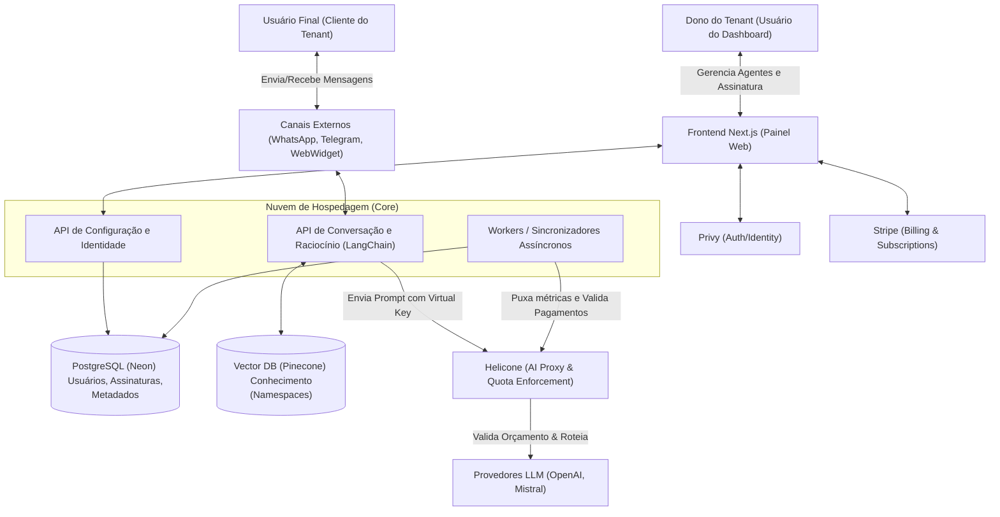

# 1. Visão Geral e Arquitetura de Alto Nível

## 1.1 Introdução

Este Documento de Design de Software (SDD) descreve a arquitetura completa da Plataforma Multi-Tenant de Agentes de IA ("Ecossistema Govinda Systems"). A plataforma tem como objetivo permitir que usuários (Tenant Owners) criem, configurem e implementem Agentes Inteligentes em diversos canais de comunicação de forma autônoma (Self-Service).

O sistema provê infraestrutura em nuvem segura para autenticação, controle de limites financeiros de tokens, processamento de NLP com geração aumentada por recuperação (RAG) e gestão automatizada de assinaturas.

## 1.2 Objetivos do Sistema

* **Multi-Tenancy Isolado:** Prover espaços de trabalho isolados onde as bases de dados e comportamentos do Agente do Cliente A jamais interfiram no Cliente B.

* **Agnosticismo de LLM e Governança:** Centralizar a inferência por um gateway corporativo para monitorar uso de tokens em tempo real e aplicar quotas sem codificação manual.

* **Extensibilidade Omnichannel:** Abstrair o núcleo do chatbot de forma que ele possa se conectar nativamente com canais variados (WhatsApp, Webchat, Telegram).

* **Escalabilidade "Serverless":** Evitar ao máximo manter estados locais pesados (como Redis ou gateways on-premise), delegando partes não-essenciais da infraestrutura para parceiros especializados e abstraindo os bancos de dados.

## 1.3 Stack Tecnológica Consolidada

A arquitetura moderna foi desenhada sob os pilares da escalabilidade e especialização, baseada nas seguintes tecnologias:

### Frontend & Core Application

* **Framework:** Next.js (App Router).

* **Estilização/Componentes:** TailwindCSS e bibliotecas baseadas em Radix.

### Backend, Identidade e Governança

* **Autenticação (Identity):** [Privy](https://privy.io/) (Garante o fluxo de sign-up do Tenant Owner sem atritos).

* **LLM Gateway & Governança de Quotas:** [Helicone](https://helicone.ai) (Proxy reverso gerenciado, responsável pelo "Hot Path", roteamento para LLMs, monitoramento de tokens e enforcement rigoroso de limites usando *Virtual Keys*).

* **Banco de Dados Relacional (Persistência Principal):** [Neon](https://neon.tech/) PostgreSQL.

### Faturamento e Pagamentos

* **Billing Engine:** [Stripe](https://stripe.com) (Responsável por controlar assinaturas, gerenciar os planos mensais/anual e lidar com faturamento baseado em tiers).

### Motor de Inteligência e Processamento

* **Orquestração de Agentes:** LangChain & LangGraph (Para definição de ferramentas e raciocínio multi-passo).

* **Vector Database (RAG):** [Pinecone](https://pinecone.io) (Para armazenamento de embeddings organizados por namespaces para garantir separação de dados por tenant).

* **Geração de Embeddings & LLMs:** OpenAI, Mistral (roteadas sempre exclusivamente pelo Helicone).

---

## 1.4 Diagrama Lógico de Arquitetura de Alto Nível

O diagrama abaixo ilustra a relação entre os macro-serviços que compõem o ecossistema.

