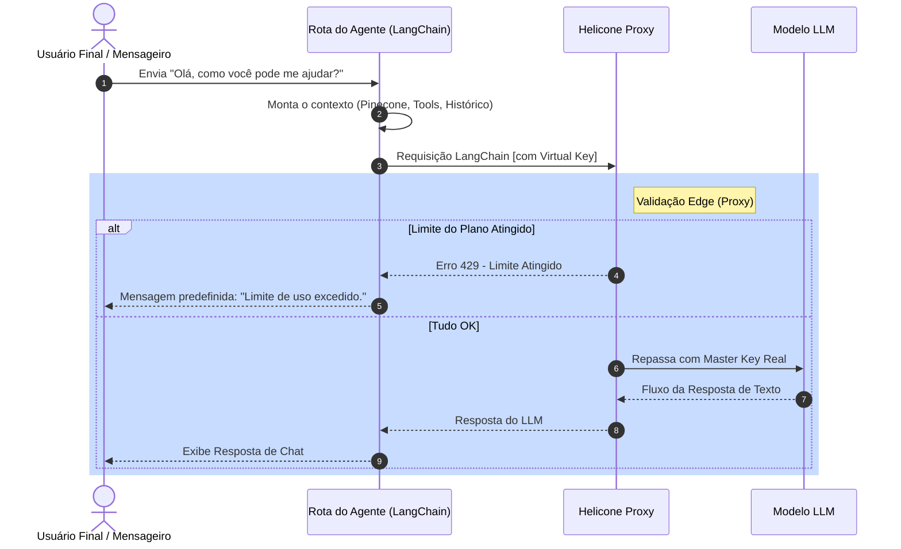

# 3. Governança de API e Gateway (Helicone)

O módulo de governança resolve o problema arquitetural mais complexo de plataformas multi-tenant de LLM: **Como evitar que os clientes consumam mais processamento de IA do que pagam sem ter que escalar dezenas de instâncias locais de cache ou Redis.**

## 3.1. Modelo de Gateway Centralizado

A decisão primária de design desta plataforma é **nunca inserir as chaves originais de IA (OpenAI, Mistral) em chamadas diretas de frontend ou de agentes locais**.

Em vez disso:

1. Cadastramos nossas Master Keys de provedores diretamente no Cofre ("Vault") do Helicone.

2. A Plataforma atua meramente como uma central administrativa que solicita ao Helicone a emissão de **Virtual Keys** individuais para cada novo Agente de um Tenant.

3. Todas as rotas de agentes que fazem inferência em tempo real apontam sua BaseURL para `https://oai.helicone.ai/v1`.

## 3.2. Estratégia de Bloqueio Rápido ("Hot Path")

Para garantir estabilidade, as validações de quota precisam ser instantâneas. O "Hot Path" (quando a mensagem chega, processa o agente e devolve resposta) não pode consultar um banco relacional no caminho crítico.

1. No momento de assinatura do Tenant, a API solicita a criação de uma Chave Virtual com o orçamento máximo atrelado.
   * *Exemplo:* "Plano Base: Limite de uso equivalente a US$ 5,00 ou X tokens, mais um limite rígido de taxa (`rate_limit`) de 30 requests por minuto."

2. O Helicone gerencia esses contadores em milissegundos internamente, distribuindo a carga de rede globalmente.

3. Se um Tenant atinge sua cota, o Gateway corta imediatamente as requisições devolvendo o status HTTP `429 Too Many Requests` (ou `402 Payment Required`).

4. O LangChain no backend captura este erro específico e emite uma mensagem formatada amigável para o usuário final: *"No momento nossos servidores atingiram a capacidade contratada. Por favor, tente novamente mais tarde."*

## 3.3. Sincronização de Dados ("Cold Path")

Como o Hot Path fica restrito ao proxy e provedora, precisamos recuperar essa informação de tempos em tempos para atualizar nossos próprios relatórios no Neon e avisar o sistema de faturamento.

* **Workers/Cronjobs (Vercel ou Scheduler externo):** Uma vez por hora, o sistema aciona um processo em background.

* Este processo varre a API analítica do Helicone, busca todos os Tokens Consumidos por cada Tenant_ID e atualiza ou faz o "UPSERT" no banco Neon (`monthly_usage_summaries`).

### 3.4. Fluxograma do "Hot Path" (Inferência)

