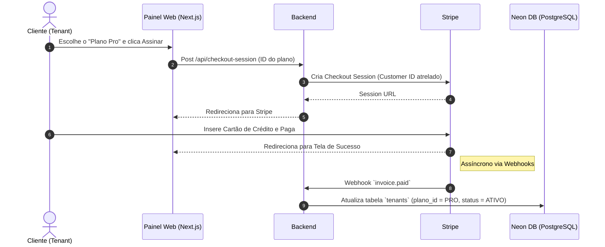

# 4. Faturamento, Pagamentos e Tiers (Stripe)

Um pilar importante do SaaS é o sistema de monetização da plataforma, que será gerenciado inteiramente pelo **Stripe**. A estratégia é misturar taxas fixas mensais com controle de capacidades flexíveis (Tiers).

## 4.1 Arquitetura de Pagamento Base

A abordagem não cobrará cêntimo a cêntimo por evento (metered event-by-event) por questões de complexidade técnica inicial. Em vez disso, a plataforma atuará com **Assinaturas Fixas por Planos** que contêm uma "franquia" pré-definida de benefícios, agentes e limite de tokens (imposto pela Virtual Key do Helicone descrita no documento 03).

### Estrutura Sugerida de Planos (Tiers)

* **Starter (ex: $29/mês):** Permite a criação de 1 agente. Acesso apenas à ferramenta padrão de pesquisa e limite mensal rigoroso de equivalência em processamento.

* **Pro (ex: $99/mês):** Permite até 5 agentes independentes. Libera ferramentas extras (ex: RAG/Upload de dezenas de PDFs, Web-Scraping). Limites de tokens mais agressivos.

* **Enterprise (Personalizado):** Ilimitado ou uso "Overage" configurado, podendo adotar Stripe Metered Billing no futuro para faturar tudo que exceder a base no final do mês.

## 4.2 Fluxo de Assinatura via Checkout

## 4.3 Gestão do Ciclo de Vida da Conta

O uso do Stripe em conjunto com o Neon permite controles muito rigorosos sobre acesso.

* **Renovação Mensal:** Ao passar um mês, a renovação do cartão é cobrada via Stripe.

* **Falha de Pagamento:** Se a cobrança falhar (cartão cancelado/sem limite), o Stripe dispara o webhook `invoice.payment_failed`.

* **Suspensão Automatizada:** Nossa aplicação escuta o evento, marca o tenant no Neon como `is_active = FALSE`. Em cascata, isso pode acionar uma chamada para o **Helicone** que imediatamente **invalida ou pausa a Virtual Key**.

* **Resultado:** Os chatbots conectados ao WhatsApp ou site dos clientes do Tenant param de responder até que ele regularize o cartão no portal do cliente do Stripe (Stripe Customer Portal).
