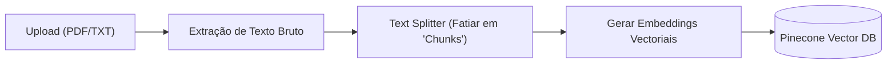

# 5. Motor de IA e Retrievial-Augmented Generation (RAG)

O núcleo cognitivo da plataforma não reside apenas em chamar uma LLM pura, mas sim em dotar o Agente com ferramentas e capacidade de consultar as bases de dados exclusivas do seu Tenant.

## 5.1 O Cérebro: LangChain e LangGraph

Ao usar LangChain, o modelo de atuação da API se baseia em uma arquitetura de "Agentic Tools". Quando um cliente envia uma mensagem para o Agente, nós não enviamos diretamente a mensagem para a OpenAI obter uma resposta genérica.

Em vez disso, nós invocamos o **LangChain Executor**, que é responsável por:

1. Analisar a intenção do cliente com a mensagem.

2. Ler a lista de `Ferramentas` (Tools) que o Tenant Owner habilitou.

3. Decidir se o Agente precisa fazer uma pesquisa interna, invocar um serviço na Web, ou apenas bater papo (conversa livre).

## 5.2 RAG (Retrieval-Augmented Generation) com Pinecone

O fluxo RAG é o que permite que empresas transformem PDFs corporativos ou manuais de uso em bases de conhecimento precisas e eficientes para o agente extrair informação.

### Como a Ingestão de Dados Funciona

Quando o Tenant Owner faz upload de um arquivo, o documento passa por uma esteira:

### Isolamento de Dados por Tenant (Namespaces)

O risco de "Data Bleeding" (o agente do Cliente A responder coisas secretas do Cliente B) é enorme se o RAG for mal implementado.

Para prevenir isso, a base principal utiliza o Pinecone. Cada vez que um texto é inserido, utilizamos o `tenant_id` ou o `agent_id` único como um **Pinecone Namespace**.
Durante uma conversa, as consultas de aproximação de similaridade de texto no banco são filtradas **obrigatoriamente e isoladamente no namespace daquele agente**.

## 5.3 Suporte Flexível a Modelos (Model Agnosticism)

Devido ao uso da camada abstrata do Helicone e LangChain, caso a Mistral torne-se mais barata amanhã, ou uma versão nova e mais potente da Anthropic for lançada, os modelos de instanciamento de IA ficam fáceis de plugar e substituir globalmente sem reescrever fluxos imensos de regras.
