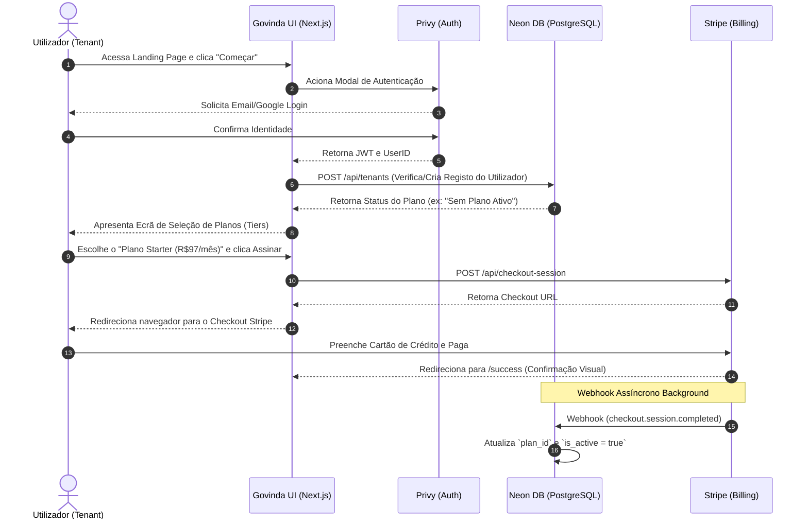
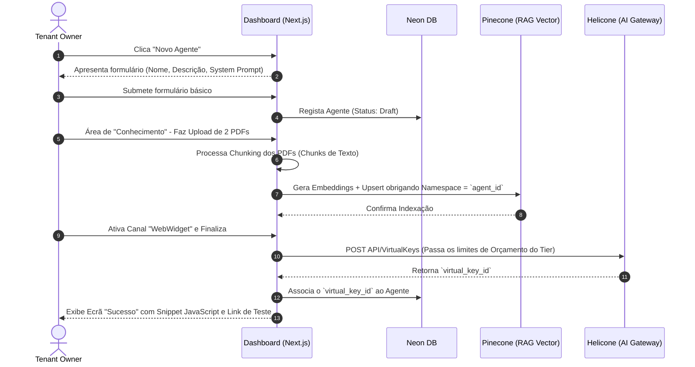
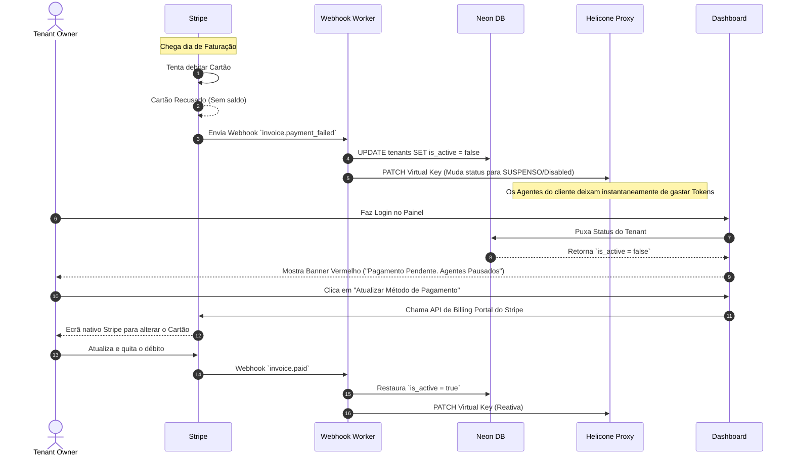

# 2. Jornadas de Usuário e Fluxos Globais End-to-End

A arquitetura do sistema e a experiência do usuário (UX) precisam fluir juntas. Esta seção documenta os caminhos ponta-a-ponta que o cliente ("Tenant Owner") irá trilhar, clarificando os processos assíncronos e a delegação de interface (UI) entre a nossa plataforma e os serviços integrados.

## 2.1 Jornada Global A: Onboarding e Subscrição Inicial

O objetivo desta jornada é minimizar o atrito, garantindo que o utilizador consiga testar o produto de forma rápida (através da criação inicial de conta), mas estabelecendo imediatamente a conversão no Stripe como portal de transição.

### O Fluxo

---

## 2.2 Jornada Global B: Criação de Agente, Base de Dados (RAG) e Implementação

Com a conta já paga, a jornada principal ocorre no Dashboard de Configuração, onde o sistema faz a ponte entre o Pinecone e a Governança Helicone.

### Fluxo Visual

---

## 2.3 Jornada Global C: Gestão de Pagamento Recusado e Bloqueio

A segurança comercial da plataforma assenta na sua capacidade de travar custos instantaneamente se um utilizador não pagar, ao mesmo tempo que oferece uma UX clara de resolução, sem o suporte humano precisar de intervir.

### Sequência de Ações

