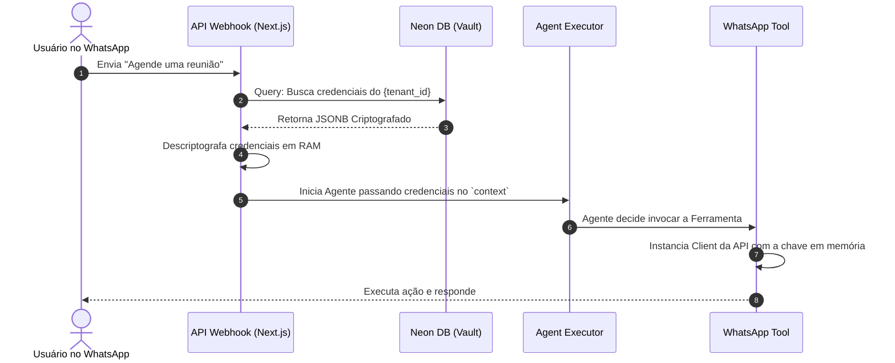

# 7. Gestão de Segredos e Integrações de Terceiros (Integration Vault)

Para que os Agentes possam executar ações (Tools) e se comunicar em canais externos (WhatsApp, Telegram), eles precisam assumir a identidade do Tenant nessas plataformas. Este documento especifica como a plataforma armazenará e injetará essas credenciais com segurança.

## 7.1 Cenários de Integração

O ecossistema divide as integrações de terceiros em três grandes cenários, baseados no mecanismo de autenticação exigido pelos provedores externos:

### Cenário A: Chaves Estáticas e Tokens de Longa Duração (Bring Your Own Key - BYOK)

* **Exemplos:** OpenAI (se o cliente quiser usar sua própria chave em vez da nossa via Helicone), SendGrid, CRMs legados, APIs de ERP customizadas.

* **Mecanismo:** O Tenant Owner acessa o painel, escolhe a ferramenta e cola uma string estática (API Key ou Bearer Token).

* **Desafio:** O segredo nunca expira automaticamente, tornando o vazamento crítico.

### Cenário B: Canais de Mensageria e Webhooks (Ex: WhatsApp)

* **Exemplos:** WhatsApp Cloud API (Meta), Telegram Bot API.

* **Mecanismo (O Caso do WhatsApp):** A integração exige múltiplas variáveis. O cliente precisa fornecer o Access Token (Permanente ou Temporário), o Phone Number ID e o WABA ID. Em contrapartida, nossa plataforma gera uma URL de Webhook única (ex: `https://api.govinda.com/webhooks/whatsapp/{tenant_id}`) e um Verify Token para o cliente cadastrar na Meta.

* **Desafio:** Segurança bidirecional. Precisamos guardar a chave para enviar mensagens, e validar a assinatura criptográfica da Meta para receber mensagens.

### Cenário C: Autenticação Delegada (OAuth 2.0)

* **Exemplos:** Google Meet/Calendar, Slack, Microsoft Teams.

* **Mecanismo:** O cliente clica em "Conectar", é redirecionado para o provedor e autoriza o app.

* **Desafio:** A plataforma recebe um Access Token (de vida curta, ex: 1 hora) e um Refresh Token. É necessário gerenciar a renovação contínua desses tokens em background antes do agente executar a ação.

## 7.2 Arquitetura do Cofre de Integrações (Vault Interno)

Para manter a stack enxuta e centralizada no Neon DB (PostgreSQL), construiremos um "Cofre" lógico usando Criptografia em Repouso.

### Modelagem de Dados (`tenant_integrations`)

Em vez de criar colunas específicas na tabela de tenants (ex: `whatsapp_token`), usaremos uma tabela relacional genérica para suportar a adição de infinitas novas ferramentas no futuro.

```sql
CREATE TABLE tenant_integrations (
    id UUID PRIMARY KEY DEFAULT gen_random_uuid(),
    tenant_id UUID REFERENCES tenants(id) ON DELETE CASCADE,
    provider VARCHAR(50) NOT NULL, -- ex: 'whatsapp', 'google_calendar', 'custom_erp'
    credentials JSONB NOT NULL,    -- Payload criptografado
    is_active BOOLEAN DEFAULT TRUE,
    created_at TIMESTAMP DEFAULT NOW(),
    updated_at TIMESTAMP DEFAULT NOW(),
    UNIQUE(tenant_id, provider)    -- Um tenant só tem uma config ativa por provedor
);
```

### O Motor de Criptografia (AEAD - AES-256-GCM)

A coluna `credentials` jamais armazenará JSON em texto plano. A arquitetura implementará um utilitário em Node.js (`src/lib/encryption.ts`) usando o módulo nativo `crypto`.

* **A Chave Mestra (Master Key):** Uma variável de ambiente ultrassecreta configurada apenas no painel da Vercel (`ENCRYPTION_MASTER_KEY` - 32 bytes).

* **Criptografia (Write):** Quando o usuário salva as credenciais do WhatsApp no Dashboard, o backend gera um Vetor de Inicialização (IV) único, criptografa o objeto JSON `{ "accessToken": "EAAB...", "phoneId": "123..." }`, e salva o IV junto com o dado cifrado (Auth Tag) no Neon DB.

* **Descriptografia (Read):** A descriptografia ocorre exclusivamente na memória (RAM) do Worker/API no exato momento em que o Agente precisa usar a ferramenta, sendo descartada pelo Garbage Collector logo após o uso.

## 7.3 Fluxo de Execução Segura no LangChain

O isolamento do contexto (Context Isolation) é crucial para evitar que o agente do Cliente A use o WhatsApp do Cliente B.



## 7.4 Regras de Segurança e Compliance

1. **Zero-Exposure API:** Nenhuma rota `GET /api/integrations` retornará o token descriptografado para o frontend do Dashboard. Se o cliente precisar alterar a chave do WhatsApp, ele deve sobrescrever a antiga com uma nova. A interface mostrará apenas: `Token: ************abcd`.

2. **Separação de Preocupações:** Ferramentas (Tools) no LangChain devem ser escritas de forma stateless (sem estado). A cada nova invocação, a Tool recebe as credenciais através do parâmetro `callbacks` ou `configurable` do LangChain, garantindo que não haja vazamento de contexto entre execuções assíncronas concorrentes de diferentes tenants na mesma infraestrutura Vercel.
